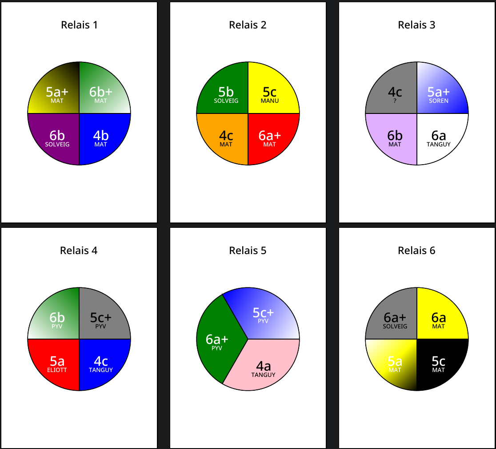

Climbing Route Chart Generator
==============================

[English version](README.md)

## Aperçu

__Climbing Route Chart Generator__ est une application Python conçue pour générer des graphiques en camembert visuels de voies d'escalade en salle. Ces graphiques sont produits à partir d'une entrée CSV, illustrant la distribution des cotations des voies et les ouvreurs associés. L'outil est idéal pour les salles d'escalade qui souhaitent visualiser la distribution des voies dans un format facile à comprendre.



## Installation

Pour configurer Climbing Route Chart Generator, suivez ces étapes :

1. Créez un environnement virtuel dans un dossier nommé "env":
   ```bash
   python -m venv env
   ```
2. Activez l'environnement virtuel :
   - Sur Windows :
     ```bash
     .\env\Scripts\activate
     ```
   - Sur Unix ou MacOS :
     ```bash
     source env/bin/activate
     ```
3. Installez les dépendances requises :
   ```bash
   pip install -r requirements.txt
   ```

## Utilisation

Exécutez le script avec la commande suivante :

```bash
./route-charts.py -i <input_file.csv> [-o <output_file.pdf>]
```

### Arguments

Reportez-vous à la sortie de `./route-charts.py --help` pour une liste de tous les arguments optionnels.

## Format d'Entrée

L'entrée doit être un fichier CSV avec les colonnes suivantes :

- Relais
- Couleur
- Cotation
- Ouvreur

## Licence

Ce projet est libre de droit. Pour plus de détails, voir [UNLICENSE](UNLICENSE).
